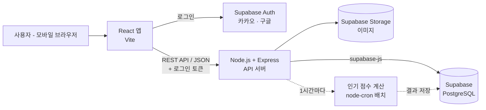

# 굿즈픽 (GoodzPick)

> 내 주변 굿즈샵의 재고를 확인하고, 픽업·배달까지 한 번에.
> 팀 JJE

---

## 목차
1. [기술 스택](#1-기술-스택)
2. [시스템 아키텍처](#2-시스템-아키텍처)
3. [폴더 구조](#3-폴더-구조)
4. [사전 준비 (개발 시작 전 필수)](#4-사전-준비-개발-시작-전-필수) — 설치할 프로그램, 패키지 설치 방법·용도
5. [프로젝트 실행 방법](#5-프로젝트-실행-방법)
6. [환경 변수](#6-환경-변수)
7. [협업 규칙](#7-협업-규칙)
8. [API 규칙](#8-api-규칙)
9. [탭별 담당](#9-탭별-담당)

---

## 1. 기술 스택

| 구분 | 기술 | 비고 |
|---|---|---|
| Frontend | **React 19 + Vite** | **모바일 우선 웹앱** (브라우저로 접속, 앱 설치 없음) |
| 웹앱 설정 | vite-plugin-pwa (선택) | 휴대폰 홈 화면에 아이콘 추가·전체화면 실행 |
| 라우팅 | React Router | 하단 탭 5개(홈/굿즈샵/카테고리/찜/마이) 라우팅 |
| 서버 상태 | TanStack Query | 서버에서 받아온 데이터(상품 목록 등)를 캐싱해 같은 요청 반복 방지, 로딩·에러 상태 자동 관리 |
| 클라이언트 상태 | Zustand | 로그인 정보, 장바구니 개수 등 화면 여러 곳에서 쓰는 전역 상태 |
| HTTP | Axios | 프론트 → Express API 요청 도구. 서버 주소·로그인 토큰 헤더를 한 곳에서 설정 |
| 스타일 | Tailwind CSS (또는 styled-components) | 팀 확정 필요 |
| Backend | **Node.js + Express** | REST API |
| DB | **Supabase (PostgreSQL)** | 팀 공용 프로젝트 1개, 대시보드에서 테이블 생성·조회 |
| DB 접근 | supabase-js | Express에서 DB를 읽고 쓰는 공식 라이브러리 (별도 ORM 없이 사용) |
| 인증 | Supabase Auth | 카카오 / 구글 소셜 로그인. 발급된 토큰을 Express에서 검증 |
| 이미지 저장 | Supabase Storage | 상품·굿즈샵·배너 이미지 업로드 |
| 협업 도구 | GitHub, Notion, Figma | |
| 코드 품질 | ESLint + Prettier | ESLint: 버그 날 만한 코드 경고 / Prettier: 코드 모양(들여쓰기·따옴표) 자동 통일 |

---

## 2. 시스템 아키텍처



### 2-1. 요청 흐름
- **로그인:** 프론트가 Supabase Auth와 직접 처리합니다. 받은 토큰을 Express 요청 헤더에 담아 보내면, Express가 이 토큰으로 사용자를 확인합니다.
- **데이터 조회·저장:** 전부 Express를 거칩니다. 프론트에서 DB를 직접 부르지 않아 로직이 서버 한 곳에 모입니다.

### 2-2. 보안
- **서버 키:** `service_role` 키(모든 권한)는 서버에서만 씁니다. **절대 프론트 코드나 GitHub에 넣지 않습니다.**
- **프론트 키:** `anon` 키(로그인용)만 씁니다.
- **RLS(Row Level Security):** 모든 테이블에 켜 둡니다. 정책을 따로 만들지 않으면 `anon` 키로는 테이블을 읽을 수 없어서, 프론트 키가 노출돼도 데이터가 안전합니다.

### 2-3. 백엔드 계층
- **Router:** 주소(`/api/v1/home`)와 Controller를 연결
- **Controller:** 요청 받기·응답 보내기만 담당
- **Service:** 실제 로직 (예: 재고 임박 상품 고르기, 추천 상품 고르기)
- **Repository:** supabase-js로 DB 조회·저장

### 2-4. 웹앱 화면 기준
- **웹앱 화면 크기:** 디자인 기준 폭 390px, 최대 폭 480px (`max-width: 480px; margin: 0 auto`)
- **PC에서 볼 때:** 화면 가운데에 폰 크기로 표시
- **하단 탭바:** `position: fixed`로 화면 아래 고정
- **아이폰 하단 여백:** `env(safe-area-inset-bottom)`만큼 여백 추가 (홈 바에 탭이 가려지지 않게)
- **viewport 설정:** `index.html`에 `<meta name="viewport" content="width=device-width, initial-scale=1, viewport-fit=cover">` 추가

### 2-5. 주기 작업 (배치)
- **인기 굿즈 점수:** 홈 "지금 뜨는 굿즈 > 인기" 순위에 쓰는 점수(`products.popularity_score`)
- **왜 따로 계산하나:** 최근 7일 찜·판매·조회 수를 모든 상품에 대해 합산해야 해서, 홈을 열 때마다 계산하면 느려집니다.
- **방법:** `node-cron`으로 1시간마다 미리 계산해 저장하고, 홈에서는 저장된 점수로 정렬만 합니다.

---

## 3. 폴더 구조

하나의 저장소에 `frontend`(프론트엔드)와 `backend`(백엔드) 폴더를 함께 둡니다.

```
goodzpick/
├── frontend/                  # React (Vite)
│   ├── public/
│   └── src/
│       ├── api/               # axios 인스턴스, API 호출 함수
│       ├── lib/supabase.js    # Supabase 클라이언트 (로그인 전용, anon 키)
│       ├── components/        # 공통 컴포넌트 (ProductCard, ShopCard, Header, TabBar ...)
│       ├── pages/
│       │   ├── home/          # 홈 탭
│       │   ├── shops/         # 굿즈샵 탭
│       │   ├── category/      # 카테고리 탭
│       │   ├── wish/          # 찜 탭
│       │   ├── my/            # 마이 탭
│       │   └── common/        # 상품 상세, 굿즈샵 상세, 검색, 알림, 장바구니, 주문
│       ├── hooks/             # 커스텀 훅 (useHome, useSearch ...)
│       ├── store/             # Zustand 전역 상태
│       ├── styles/
│       ├── utils/
│       ├── App.jsx
│       └── main.jsx
│
├── backend/                   # Node.js (Express)
│   ├── supabase/
│   │   ├── schema.sql         # 테이블 생성 SQL (변경 이력 관리용)
│   │   └── seed.sql           # 더미 데이터
│   └── src/
│       ├── lib/supabase.js    # Supabase 클라이언트 (service_role 키)
│       ├── routes/            # 라우터 (home.routes.js, search.routes.js ...)
│       ├── controllers/
│       ├── services/
│       ├── repositories/      # supabase-js로 DB 조회
│       ├── middlewares/       # 인증, 에러 처리, 로깅
│       ├── jobs/              # 배치 작업 (인기 점수 갱신)
│       ├── utils/
│       └── app.js
│
├── .github/
│   ├── ISSUE_TEMPLATE/        # 이슈 양식 (기능, 버그)
│   └── pull_request_template.md
├── .vscode/                   # 저장 시 자동 정리 설정
├── .prettierrc                # 코드 모양 규칙
├── .gitignore                 # GitHub에 안 올릴 파일 목록
├── .nvmrc                     # Node 버전 (24)
├── SETUP.md                   # 팀장 초기 세팅 가이드
└── README.md
```

---

## 4. 사전 준비 (개발 시작 전 필수)

### 4-1. 모든 팀원이 설치할 것

| 항목 | 버전 | 설치 / 확인 |
|---|---|---|
| **Node.js** | 24 LTS (팀 전원 동일 버전) | [nvm](https://github.com/nvm-sh/nvm) 사용 권장 (Windows는 nvm-windows). `node -v` |
| **npm** | Node에 포함 | `npm -v` |
| **Git** | 최신 | `git --version`, `git config --global user.name / user.email` 설정 |
| **Supabase 계정** | - | [supabase.com](https://supabase.com) 가입 후 팀 프로젝트 초대 수락 (DB 설치 불필요) |
| **VS Code 확장** | - | ESLint, Prettier, GitLens |
| **API 테스트 도구** | - | Postman 또는 Thunder Client |

> 루트에 `.nvmrc` 파일(내용: `24`)을 두고, 프로젝트 폴더에서 `nvm use` 로 버전을 맞춥니다.

### 4-2. 팀장(또는 담당자)이 한 번만 할 것

> 각 항목을 **어떻게 하는지**(누를 메뉴, 파일 내용, 명령어)는 👉 **[SETUP.md (팀장 초기 세팅 가이드)](./SETUP.md)** 에 순서대로 정리되어 있습니다. 괄호 안 번호가 SETUP.md의 절 번호입니다.

- [ ] GitHub Organization/Repository 생성, 팀원 초대 ([1](./SETUP.md#1-github-저장소-만들기))
- [ ] `frontend`, `backend` 프로젝트 뼈대 만들기 ([2](./SETUP.md#2-프로젝트-뼈대-만들기))
- [ ] `.gitignore` 작성 ([3](./SETUP.md#3-gitignore-작성))
- [ ] ESLint + Prettier 설정 파일 만들기 ([4](./SETUP.md#4-eslint--prettier-설정))
- [ ] `.env.example` 작성 — 실제 `.env`는 **절대 커밋 금지**, 비공개 노션/카톡으로 공유 ([5](./SETUP.md#5-envexample-작성))
- [ ] Issue / PR 템플릿 추가 ([6](./SETUP.md#6-issue--pr-템플릿-추가))
- [ ] 첫 push, `develop` 브랜치 생성 ([7](./SETUP.md#7-첫-push와-develop-브랜치))
- [ ] `main`, `develop` **브랜치 보호 규칙** 설정 — PR 없이 push 금지, 리뷰 1명 이상 승인 ([8](./SETUP.md#8-브랜치-보호-규칙))
- [ ] Supabase 프로젝트 생성 (리전: Seoul), 팀원 초대 ([9](./SETUP.md#9-supabase-프로젝트-만들기))
- [ ] 소셜 로그인 설정 — 카카오·구글 앱 등록 후 Supabase에 키 입력 ([10](./SETUP.md#10-소셜-로그인-카카오구글))
- [ ] Storage 버킷 생성: `products`, `shops`, `banners` ([11](./SETUP.md#11-storage-버킷-만들기))
- [ ] 공통 DB 스키마 확정·실행, 모든 테이블 RLS 켜기 ([12](./SETUP.md#12-db-스키마-작성과-rls))
- [ ] 더미 데이터(`seed.sql`) 작성 ([13](./SETUP.md#13-더미-데이터-seed))
- [ ] 팀원에게 저장소·Supabase 초대, `.env` 값 공유 ([14](./SETUP.md#14-팀원에게-공유할-것))

> 네이버 로그인은 Supabase 기본 제공 목록에 없어서, 필요하면 별도 구현이 필요합니다. 1차 개발은 카카오·구글만 진행합니다.

### 4-3. 패키지(라이브러리) 설치 방법

기술 스택에 적힌 React Router, TanStack Query, Zustand, Axios, Express 등은 **따로 프로그램을 다운받는 것이 아니라 npm 패키지**입니다.
Node.js만 설치되어 있으면 `npm install` 명령어로 프로젝트 폴더 안에 설치됩니다.

#### ① 처음 세팅 (팀장 1명만, 한 번만)

```bash
# 프론트엔드
npm create vite@latest frontend -- --template react
cd frontend
npm install react-router-dom @tanstack/react-query zustand axios @supabase/supabase-js
npm install -D tailwindcss @tailwindcss/vite eslint prettier   # 스타일·코드 품질 도구
# npm install -D vite-plugin-pwa                              # (선택) 홈 화면 추가 기능

# 백엔드
cd ..
mkdir backend && cd backend
npm init -y
npm install express cors dotenv @supabase/supabase-js node-cron
npm install -D nodemon eslint prettier
```

- 설치하면 각 폴더의 `package.json`에 "이 프로젝트가 쓰는 패키지 목록"이 자동으로 기록됩니다.
- `backend/package.json`의 `"scripts"`에 `"dev": "nodemon src/app.js"`를 추가해야 `npm run dev`로 서버가 실행됩니다.
- 이 상태로 GitHub에 push합니다.

#### ② 나머지 팀원 (clone 후)

```bash
cd frontend && npm install
cd ../backend && npm install
```

`package.json` 목록을 보고 필요한 패키지를 **전부 자동으로** 설치합니다. 하나씩 설치할 필요가 없습니다.

#### ③ 주의사항

- 설치된 파일은 `node_modules/` 폴더에 들어갑니다. 용량이 커서 **GitHub에 올리지 않습니다** (`.gitignore`에 포함).
- `package-lock.json`은 **꼭 커밋합니다.** 팀원 모두 같은 버전이 설치되게 해 줍니다.
- 새 패키지를 추가할 땐 팀에 먼저 공유하고, 추가한 사람이 `package.json`·`package-lock.json`을 커밋합니다. 다른 팀원은 pull 받은 뒤 `npm install`을 다시 실행합니다.
- `-D`가 붙은 패키지는 **개발할 때만** 쓰는 도구(자동 재시작, 코드 검사 등)라는 뜻입니다.

#### ④ 패키지별 용도

**frontend (프론트엔드)**

| 패키지 | 용도 | 사용 예 |
|---|---|---|
| `react`, `react-dom` | 화면 만들기 (Vite가 자동 설치) | 모든 컴포넌트 |
| `react-router-dom` | 페이지 이동 | 하단 탭 이동, 상품 상세로 이동 |
| `@tanstack/react-query` | 서버 데이터 캐싱·로딩/에러 상태 | 홈 섹션 목록 불러오기 |
| `zustand` | 전역 상태 | 로그인 사용자, 장바구니 개수 뱃지 |
| `axios` | Express API 요청 | `GET /api/v1/home` |
| `@supabase/supabase-js` | 로그인 (카카오·구글) | 로그인 버튼, 토큰 받기 |
| `tailwindcss`, `@tailwindcss/vite` | 스타일 (팀 확정 시) | `className="p-4 text-sm"` |
| `eslint`, `prettier` | 코드 검사·자동 정렬 | 저장 시 자동 포맷 |
| `vite-plugin-pwa` (선택) | 휴대폰 홈 화면 추가 | 웹앱 아이콘·전체화면 |

**backend (백엔드)**

| 패키지 | 용도 |
|---|---|
| `express` | API 서버 |
| `cors` | 프론트(5173 포트)에서 서버(4000 포트)로 요청 허용 |
| `dotenv` | `.env` 파일의 키 값 읽기 |
| `@supabase/supabase-js` | DB 조회·저장, Storage 업로드, 로그인 토큰 확인 |
| `node-cron` | 정해진 시간마다 작업 실행 (인기 점수 갱신) |
| `nodemon` (-D) | 코드 저장 시 서버 자동 재시작 |
| `eslint`, `prettier` (-D) | 코드 검사·자동 정렬 |

---

## 5. 프로젝트 실행 방법

```bash
# 1. 저장소 클론
git clone https://github.com/<org>/goodzpick.git
cd goodzpick

# 2. 백엔드
cd backend
npm install                   # package.json에 적힌 패키지 전부 설치
cp .env.example .env          # 값 채우기 (Supabase 대시보드 > Project Settings > API)
npm run dev                   # http://localhost:4000
# DB는 팀 공용 Supabase 프로젝트를 쓰므로 로컬 설치·마이그레이션이 필요 없습니다.

# 3. 프론트엔드 (새 터미널)
cd frontend
npm install                   # package.json에 적힌 패키지 전부 설치
cp .env.example .env
npm run dev                   # http://localhost:5173
```

---

## 6. 환경 변수

**backend/.env.example**
```
PORT=4000
SUPABASE_URL=
SUPABASE_SERVICE_ROLE_KEY=     # 서버 전용, 절대 공개 금지
CLIENT_URL=http://localhost:5173
```

**frontend/.env.example**
```
VITE_API_BASE_URL=http://localhost:4000/api/v1
VITE_SUPABASE_URL=
VITE_SUPABASE_ANON_KEY=        # 로그인용 공개 키
```

> 카카오·구글 로그인 키는 Supabase 대시보드에만 입력하므로 `.env`에 넣지 않습니다.

---

## 7. 협업 규칙

### 브랜치 전략 (Git Flow 간소화)

```
main        배포용 (직접 push 금지)
 └ develop  개발 통합 브랜치
    └ feature/{탭}-{기능}   예) feature/home-banner, feature/home-search
    └ fix/{탭}-{내용}       예) fix/home-low-stock-sort
```

1. 작업 전 Issue 생성 → 이슈 번호로 브랜치 생성
2. `develop`에서 브랜치 분기 → 작업 → `develop`으로 PR
3. 리뷰 1명 승인 후 머지, 머지된 브랜치는 삭제

### 커밋 메시지

```
타입: 요약 (#이슈번호)

feat: 홈 인기 굿즈 섹션 추가 (#12)
```

| 타입 | 의미 |
|---|---|
| feat | 새 기능 |
| fix | 버그 수정 |
| refactor | 리팩토링 |
| style | 코드 포맷, 세미콜론 등 (동작 변경 없음) |
| docs | 문서 |
| chore | 설정, 패키지 설치 |

### 코드 컨벤션
- 컴포넌트 파일: `PascalCase.jsx` (예: `ProductCard.jsx`)
- 함수 / 변수: `camelCase`, 상수: `UPPER_SNAKE_CASE`
- DB 테이블 / 컬럼: `snake_case` (예: `shop_inventories.stock_quantity`)
- 공통 컴포넌트(`components/`)를 수정할 때는 **PR 설명에 영향 받는 탭을 명시**

---

## 8. API 규칙

- Base URL: `/api/v1`
- 리소스는 복수형 명사: `/products`, `/shops`, `/categories`
- 인증 필요 API는 `Authorization: Bearer {accessToken}` 헤더 사용

**응답 형식 (성공)**
```json
{
  "success": true,
  "data": { },
  "message": null
}
```

**응답 형식 (실패)**
```json
{
  "success": false,
  "data": null,
  "message": "상품을 찾을 수 없습니다.",
  "code": "PRODUCT_NOT_FOUND"
}
```

**목록 페이지네이션**: `?page=1&size=20` → 응답 `data`에 `items`, `page`, `size`, `totalCount` 포함

---

## 9. 탭별 담당

| 탭 | 담당 | 주요 범위 |
|---|---|---|
| 홈 | 팀원 1 | 배너, 카테고리 바로가기, 인기/신상품/신규 입점/재고 임박/추천 섹션, 통합 검색 |
| 굿즈샵 | 팀원 2 | 굿즈샵 목록·필터·정렬, 굿즈샵 상세 |
| 카테고리 | 팀원 3 | 카테고리 화면, 카테고리 상품 목록 |
| 찜 | 팀원 4 | 찜한 상품/굿즈샵, 재입고 알림 |
| 마이 | 팀원 5 | 주문 내역, 멤버십, 쿠폰, 배송지, 설정 |
| 공통 | 전원 | 상품 상세, 장바구니, 주문/결제, 알림, 검색 |

> 자세한 기획·화면 흐름·DB 설계는 Notion 참고
